# SQL Server Merge Replication Setup Guide

[](https://www.microsoft.com/sql-server)
[](https://docs.microsoft.com/sql/ssms/)
[]()

> **Comprehensive documentation for implementing, maintaining, and troubleshooting SQL Server Merge Replication in a Hub-and-Spoke topology.**

## 🎯 Overview

This repository provides complete documentation for setting up **bidirectional data synchronization** between a central SQL Server (Publisher/Hub) and multiple distributed SQL Server instances (Subscribers/Spokes), including SQL Server Express editions.

### Key Features

- ✅ **Step-by-step implementation guides** with PowerShell automation
- ✅ **Hub-and-Spoke architecture** optimized for SQL Server Express subscribers
- ✅ **Offline resilience** - changes sync automatically when reconnected
- ✅ **Conflict resolution** with configurable policies
- ✅ **Production-ready** security and maintenance procedures

---

## 📖 Documentation

### Getting Started

| Document | Description |
|----------|-------------|
| [Overview](getting-started/01-overview.md) | Architecture, requirements, and decision guidance |
| [Prerequisites](getting-started/02-prerequisites.md) | Pre-deployment checklist (complete before setup) |
| [Glossary](getting-started/03-glossary.md) | Terminology and concepts explained |

### Setup Guides

| Document | Description |
|----------|-------------|
| [Implementation Guide](setup/01-implementation-guide.md) | Complete 5-phase setup walkthrough |
| [Security Guide](setup/02-security-guide.md) | Authentication, encryption, and hardening |

### Operations

| Document | Description |
|----------|-------------|
| [Maintenance Guide](operations/01-maintenance-guide.md) | Monitoring, tuning, and subscriber management |
| [Troubleshooting](operations/02-troubleshooting-guide.md) | Common errors with diagnostic flowcharts |
| [Disaster Recovery](operations/03-disaster-recovery.md) | Backup, restore, and failover procedures |

### Reference

| Document | Description |
|----------|-------------|
| [Architecture](reference/01-architecture.md) | Detailed topology diagrams |
| [FAQ](reference/02-faq.md) | Frequently asked questions |

---

## 🚀 Quick Start

```mermaid
flowchart LR
    A[1. Prerequisites] --> B[2. Implementation]
    B --> C[3. Security]
    C --> D[4. Validation]
    D --> E[✅ Production Ready]
```



1. **Complete the [Prerequisites Checklist](getting-started/02-prerequisites.md)**
   - Verify network connectivity, firewall rules, and service accounts

2. **Follow the [Implementation Guide](setup/01-implementation-guide.md)**
   - Configure Distribution → Create Publication → Add Subscriptions

3. **Apply [Security Configuration](setup/02-security-guide.md)**
   - Set up proper authentication and encryption

4. **Run validation tests** (included in Implementation Guide)
   - Test bidirectional sync, offline resilience, and conflict resolution

---

## 📋 Requirements

### Publisher (Hub)
- SQL Server 2019/2022/2025 **Standard** or **Enterprise**
- Replication feature installed
- Static IP or stable DNS hostname

### Subscribers (Spokes)
- SQL Server 2019/2022/2025 (any edition, including **Express**)
- Replication feature installed
- Network access to Publisher

### Network
| Port | Protocol | Purpose |
|------|----------|---------|
| 1433 | TCP | SQL Server connections |
| 1434 | UDP | SQL Server Browser |
| 445 | TCP | SMB (snapshot folder) |

---

## 📁 Repository Structure

```
Merge-Replication-Setup/
├── README.md
├── getting-started/
│   ├── 01-overview.md
│   ├── 02-prerequisites.md
│   └── 03-glossary.md
├── setup/
│   ├── 01-implementation-guide.md
│   └── 02-security-guide.md
├── operations/
│   ├── 01-maintenance-guide.md
│   ├── 02-troubleshooting-guide.md
│   └── 03-disaster-recovery.md
├── reference/
│   ├── 01-architecture.md
│   └── 02-faq.md
└── assets/
    └── (screenshots - coming soon)
```

---

## 🔧 Troubleshooting

Encountering issues? Start here:

| Symptom | Likely Cause | Quick Fix |
|---------|--------------|-----------|
| "Access Denied" on snapshot | Share/NTFS permissions | Grant service account Modify access |
| "SQL Server does not exist" | Firewall blocking | Open TCP 1433, UDP 1434 |
| Sync is slow | Missing indexes | Index columns used in filters |

➡️ See full [Troubleshooting Guide](operations/02-troubleshooting-guide.md)

---

##  Support

- 📖 Check the [FAQ](reference/02-faq.md) for common questions
- 🐛 Open an [Issue](../../issues) for bugs or feature requests
- 💬 Start a [Discussion](../../discussions) for general questions
