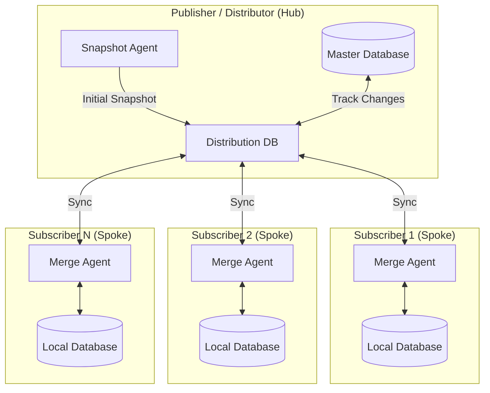

# Merge Replication Overview

## What is Merge Replication?

**Merge Replication** is a SQL Server feature that enables bidirectional data synchronization between a central database (Publisher) and multiple remote databases (Subscribers). Changes made at any node propagate to all other nodes, making it ideal for distributed environments where connectivity may be intermittent.

---

## Architecture

Merge Replication uses a **Hub-and-Spoke** topology:

### Components Explained

| Component | Role |
|-----------|------|
| **Publisher** | The "source of truth" database that defines which tables are replicated |
| **Distributor** | Stores metadata and tracks changes (usually hosted on Publisher) |
| **Subscriber** | Receives replicated data and can make local changes |
| **Snapshot Agent** | Creates initial data snapshot for new subscribers |
| **Merge Agent** | Synchronizes changes between Publisher and Subscribers |

> 📖 For detailed component diagrams, see [Architecture Reference](../reference/01-architecture.md)

---

## Requirements

### Software Requirements

| Role | Edition | Notes |
|------|---------|-------|
| Publisher/Distributor | SQL Server Standard/Enterprise | Replication feature required |
| Subscriber | SQL Server Express or higher | Express lacks SQL Agent (use Push subscriptions) |
| Management | SSMS (SQL Server Management Studio) | Latest version recommended |

### Hardware Requirements

| Component | Minimum | Recommended |
|-----------|---------|-------------|
| RAM (Publisher) | 4 GB | 8+ GB |
| RAM (Subscriber) | 2 GB | 4 GB |
| Storage (Snapshot) | 2x database size | 3x database size |
| Network | 1 Mbps | 10+ Mbps |

### Network Requirements

| Port | Protocol | Service |
|------|----------|---------|
| 1433 | TCP | SQL Server Database Engine |
| 1434 | UDP | SQL Server Browser |
| 445 | TCP | SMB (Snapshot folder access) |

> ✅ Full verification checklist: [Prerequisites](02-prerequisites.md)

---

## Next Steps

1. **[Prerequisites Checklist](02-prerequisites.md)** → Verify environment readiness
2. **[Implementation Guide](../setup/01-implementation-guide.md)** → Step-by-step setup
3. **[Glossary](03-glossary.md)** → Understand terminology

---
