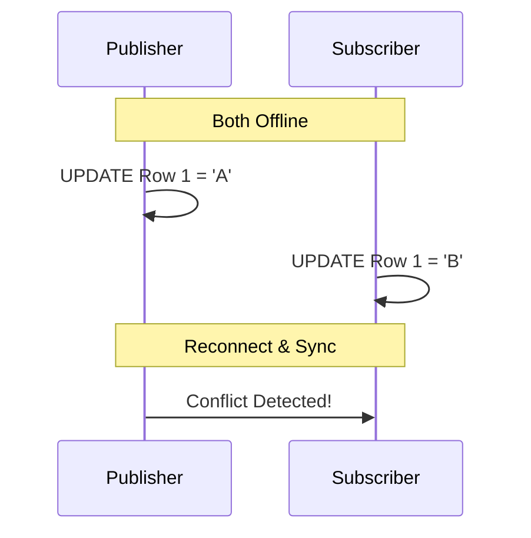

# Maintenance Guide

Day-to-day operations, monitoring, and management for Merge Replication environments.

---

## 1. Monitoring Replication Health

### Launch Replication Monitor

1. SSMS → Right-click **Replication** → **Launch Replication Monitor**
2. Add Publisher if not already present


### Status Indicators

| Status | Icon | Meaning | Action |
|--------|------|---------|--------|
| Running | 🟢 | Agent running normally | None |
| Not Running | ⚪ | Agent stopped/scheduled | Check schedule |
| Error | 🔴 | Agent failed | View error, troubleshoot |
| Warning | 🟡 | Performance issue | Review metrics |

### Quick Health Query

```sql
SELECT 
    p.publication AS Publication,
    s.subscriber_server AS Subscriber,
    CASE s.status
        WHEN 1 THEN 'Started'
        WHEN 2 THEN 'Succeeded'
        WHEN 3 THEN 'In Progress'
        WHEN 4 THEN 'Idle'
        WHEN 5 THEN 'Retrying'
        WHEN 6 THEN 'Failed'
    END AS Status,
    s.last_sync_time,
    DATEDIFF(MINUTE, s.last_sync_time, GETDATE()) AS MinutesSinceLastSync
FROM distribution.dbo.MSmerge_subscriptions s
JOIN distribution.dbo.MSpublications p ON s.publication_id = p.publication_id
ORDER BY s.last_sync_time DESC;
```

---

## 2. Handling Conflicts

### Understanding Conflicts

Conflicts occur when the same row is modified at multiple nodes before synchronization.



### View Conflicts

1. SSMS → Right-click publication → **View Conflicts**
2. Select table with conflicts
3. Review winning vs. losing row


### Resolve Conflicts Manually

1. Open Conflict Viewer
2. Select conflict row
3. Click **Submit Winner** for correct version

### Custom Conflict Resolvers

```sql
-- Set custom resolver for article
EXEC sp_changemergearticle 
    @publication = 'YourPublication',
    @article = 'YourTable',
    @property = 'article_resolver',
    @value = 'Microsoft SQL Server Additive Conflict Resolver';
```

**Available Resolvers:**
- Priority-based (default)
- Additive (sum numeric values)
- DATETIME (Earlier/Later Wins)
- Subscriber Always Wins

---

## 3. Adding New Subscribers

### Process


### Steps

1. **Prepare Subscriber:**
   - Install SQL Server
   - Create destination database
   - Configure firewall

2. **Add Subscription (from Publisher SSMS):**
   - Right-click publication → New Subscriptions
   - Add SQL Server Subscriber
   - Select Push subscription (for Express)
   - Configure agent security

3. **Verify:**
   ```sql
   -- On Subscriber
   SELECT COUNT(*) FROM YourTable;
   ```

---

## 4. Removing Subscribers

### Graceful Removal

```sql
EXEC sp_dropmergesubscription 
    @publication = 'YourPublication',
    @subscriber = 'SUBSCRIBER_NAME',
    @subscriber_db = 'SubscriberDB';
```

### Cleanup on Subscriber

```sql
-- On Subscriber, remove replication metadata
EXEC sp_removedbreplication 'SubscriberDB';
```

---

## 5. Re-initializing Subscriptions

### When to Reinitialize

- Subscription out of sync
- Schema changes made
- Data corruption detected


### Commands

```sql
-- Mark for re-initialization (preserve changes)
EXEC sp_reinitmergesubscription 
    @publication = 'YourPublication',
    @subscriber = 'SUBSCRIBER_NAME',
    @subscriber_db = 'SubscriberDB',
    @upload_first = 1;

-- Regenerate snapshot
EXEC sp_startmergesnapshotgenerationjob 
    @publication = 'YourPublication';
```

---

## 6. Performance Tuning

### Key Metrics

| Metric | Healthy | Concern |
|--------|---------|---------|
| Sync Duration | < 5 min | > 30 min |
| Pending Changes | < 1000 | > 10000 |
| Conflicts | < 10/day | > 100/day |

### Optimization Techniques

**1. Add Indexes:**
```sql
CREATE INDEX IX_rowguid ON YourTable(rowguid);
CREATE INDEX IX_FilterCol ON YourTable(FilterColumn);
```

**2. Use Row Filters:**
Reduce data volume through article filters.

**3. Optimize Agent Profiles:**


```sql
-- View available profiles
EXEC sp_help_agent_profile @agent_type = 4; -- Merge Agent
```

---

## 7. Scheduled Maintenance

### Daily
- [ ] Check Replication Monitor for errors
- [ ] Verify all agents running
- [ ] Review sync latency

### Weekly
- [ ] Review conflict reports
- [ ] Check disk space on snapshot folder
- [ ] Validate backups

### Monthly
- [ ] Update statistics:
  ```sql
  UPDATE STATISTICS YourTable;
  ```
- [ ] Clean up old metadata:
  ```sql
  EXEC distribution.dbo.sp_MSdistribution_cleanup 
      @min_distretention = 0, 
      @max_distretention = 72;
  ```

---

## 8. Common Queries

### View Recent Sync Activity

```sql
SELECT TOP 20
    session_id,
    start_time,
    end_time,
    upload_inserts + upload_updates + upload_deletes AS UploadChanges,
    download_inserts + download_updates + download_deletes AS DownloadChanges
FROM distribution.dbo.MSmerge_sessions
ORDER BY start_time DESC;
```

### Compare Row Counts

```sql
-- Publisher
SELECT 'Publisher' AS Source, COUNT(*) AS RowCount FROM YourTable;
-- Subscriber
SELECT 'Subscriber' AS Source, COUNT(*) AS RowCount FROM YourTable;
```

---

## Related Documents

- [Troubleshooting](02-troubleshooting-guide.md) → Error resolution
- [Disaster Recovery](03-disaster-recovery.md) → Backup procedures
- [Architecture](../reference/01-architecture.md) → Agent details
