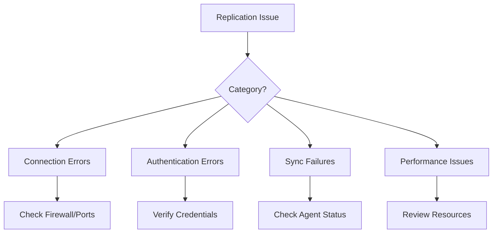
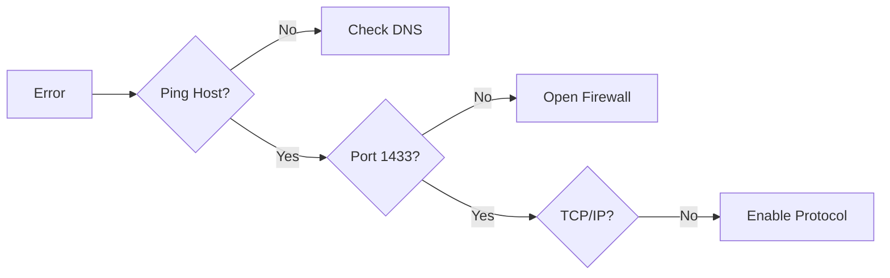
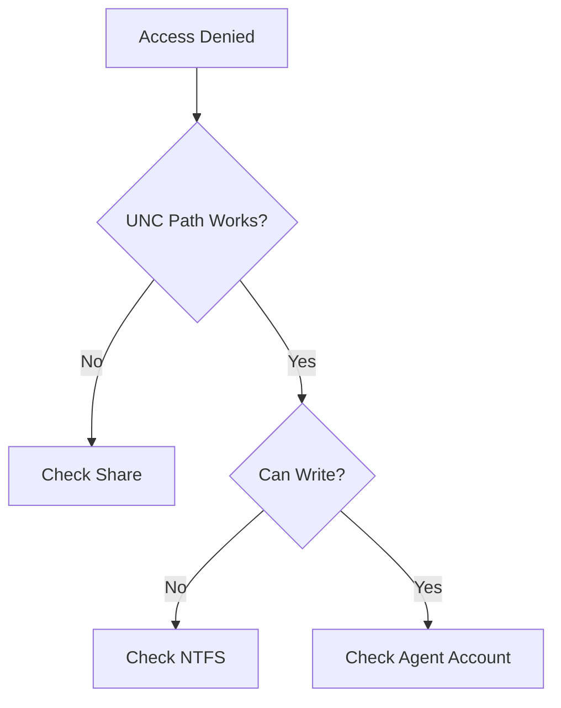
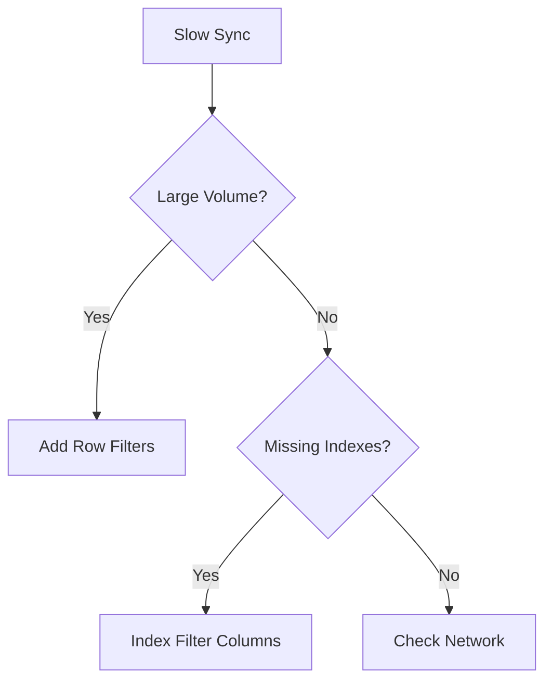

# Troubleshooting Guide

Common Merge Replication issues organized by symptom category with diagnostic steps and solutions.

---

## Quick Diagnostic Flow



---

## 1. Connection Errors

### "A network-related or instance-specific error occurred"

**Symptoms:**
- Cannot connect to Publisher from Subscriber
- Agents fail to start with network error

**Diagnostic Flow:**



**Resolution:**

1. **Test connectivity:**
   ```powershell
   Test-NetConnection -ComputerName PUBLISHER -Port 1433
   ```

2. **Check DNS/hosts:**
   ```
   # Edit C:\Windows\System32\drivers\etc\hosts
   192.168.1.100    PUBLISHER_NAME
   ```

3. **Open firewall:**
   ```powershell
   New-NetFirewallRule -DisplayName "SQL Server" -Direction Inbound -Protocol TCP -LocalPort 1433 -Action Allow
   ```

4. **Enable TCP/IP:**
   - SQL Server Configuration Manager → Protocols → Enable TCP/IP → Restart SQL

---

### "SQL Server Browser service is not running"

**Resolution:**

```powershell
Set-Service -Name "SQLBrowser" -StartupType Automatic
Start-Service -Name "SQLBrowser"
New-NetFirewallRule -DisplayName "SQL Browser" -Direction Inbound -Protocol UDP -LocalPort 1434 -Action Allow
```

---

## 2. Authentication Errors

### "Login failed for user"


**Resolution:**

1. **Check authentication mode:**
   ```sql
   SELECT SERVERPROPERTY('IsIntegratedSecurityOnly');
   -- 0 = Mixed Mode (OK), 1 = Windows Only
   ```

2. **Verify login exists:**
   ```sql
   SELECT name FROM sys.server_principals 
   WHERE name = 'sql_repl_agent';
   ```

3. **Grant permissions:**
   ```sql
   CREATE LOGIN [DOMAIN\sql_repl_agent] FROM WINDOWS;
   ALTER SERVER ROLE sysadmin ADD MEMBER [DOMAIN\sql_repl_agent];
   ```

> 🔐 See [Security Guide](../setup/02-security-guide.md) for proper account setup

---

### "Access to the path '\\SERVER\ReplData' is denied"

**Diagnostic Flow:**



**Resolution:**

1. **Test folder access:**
   ```cmd
   dir \\PUBLISHER_HOSTNAME\ReplData
   ```

2. **Grant share permissions:**
   ```powershell
   Grant-SmbShareAccess -Name "ReplData" -AccountName "sql_repl_agent" -AccessRight Change -Force
   ```

3. **Grant NTFS permissions:**
   ```powershell
   $acl = Get-Acl "C:\ReplData"
   $rule = New-Object System.Security.AccessControl.FileSystemAccessRule("sql_repl_agent","Modify","ContainerInherit,ObjectInherit","None","Allow")
   $acl.SetAccessRule($rule)
   Set-Acl "C:\ReplData" $acl
   ```

---

## 3. Synchronization Failures

### "The merge process could not deliver the snapshot"

**Resolution:**

1. **Verify snapshot exists:**
   ```cmd
   dir \\PUBLISHER_HOSTNAME\ReplData\unc\PUBLISHER_DB_PUBLICATION\
   ```

2. **Regenerate snapshot:**
   - SSMS → Replication → Local Publications
   - Right-click publication → View Snapshot Agent Status → Start


---

### "Row was updated or deleted by another transaction"

**Resolution:**

1. **View conflicts:**
   - SSMS → Right-click publication → **View Conflicts**


2. **Resolve manually:**
   - Select winning row → Submit Winner

> 🔧 See [Maintenance Guide - Conflicts](01-maintenance-guide.md#2-handling-conflicts)

---

### "The subscription is not initialized"

**Resolution:**

```sql
-- Re-initialize subscription
EXEC sp_reinitmergepullsubscription 
    @publication = 'YourPublication',
    @publisher = 'PUBLISHER_NAME',
    @publisher_db = 'YourDB';
```

Then regenerate snapshot and sync.

---

## 4. Performance Issues

### Slow Synchronization

**Diagnostic Query:**

```sql
SELECT TOP 20
    session_id,
    start_time,
    end_time,
    DATEDIFF(SECOND, start_time, end_time) AS duration_seconds,
    upload_inserts + upload_updates AS uploads,
    download_inserts + download_updates AS downloads
FROM distribution.dbo.MSmerge_sessions
ORDER BY start_time DESC;
```

**Optimization Flow:**



**Solutions:**

1. **Add indexes:**
   ```sql
   CREATE INDEX IX_FilterColumn ON YourTable(FilterColumn);
   ```

2. **Add row filters** in Publication Properties

3. **Use slow link profile:**
   - Agent Properties → Profile → Slow Link

---

### High Memory on Subscriber (Express)

**Check memory:**
```sql
SELECT 
    physical_memory_in_use_kb / 1024 AS memory_mb
FROM sys.dm_os_process_memory;
```

**Solutions:**
- Implement row filters
- Remove unnecessary articles
- Consider upgrading from Express

---

## 5. Agent-Specific Errors

### Snapshot Agent

| Error | Cause | Solution |
|-------|-------|----------|
| Unable to create folder | Permissions | Grant share/NTFS access |
| Cannot read file | Disk full | Free space |
| Timeout | Large database | Increase CommandTimeout |

### Merge Agent

| Error | Cause | Solution |
|-------|-------|----------|
| Cannot connect | Firewall | Open port 1433 |
| Login timeout | Latency | Increase LoginTimeout |
| Deadlock | Concurrent access | Retry operation |

---

## 6. Diagnostic Commands

### Quick Health Check

```sql
-- Check all agent statuses
EXEC distribution.dbo.sp_replmonitorhelppublication;

-- Check for recent errors
SELECT TOP 20 * FROM distribution.dbo.MSrepl_errors
WHERE time > DATEADD(HOUR, -24, GETDATE())
ORDER BY time DESC;
```

### View Agent Error Log

```sql
SELECT TOP 50
    time,
    comments,
    error_id
FROM distribution.dbo.MSmerge_history
WHERE error_id <> 0
ORDER BY time DESC;
```

---

## 7. Emergency: Complete Rebuild

When all else fails:

```sql
-- Drop subscriptions
EXEC sp_dropmergesubscription 
    @publication = 'YourPublication',
    @subscriber = 'all';

-- Drop publication
EXEC sp_dropmergepublication @publication = 'YourPublication';
```

Then recreate following [Implementation Guide](../setup/01-implementation-guide.md).

---

## Related Documents

- [Prerequisites](../getting-started/02-prerequisites.md) → Environment verification
- [Maintenance Guide](01-maintenance-guide.md) → Ongoing operations
- [Security Guide](../setup/02-security-guide.md) → Authentication setup
