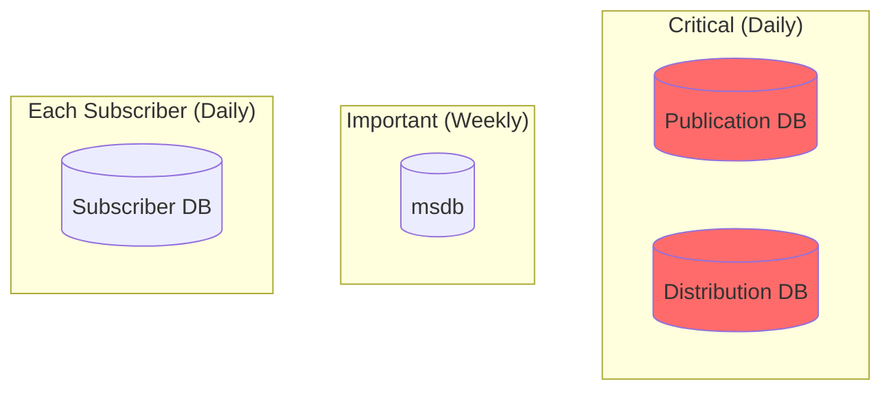
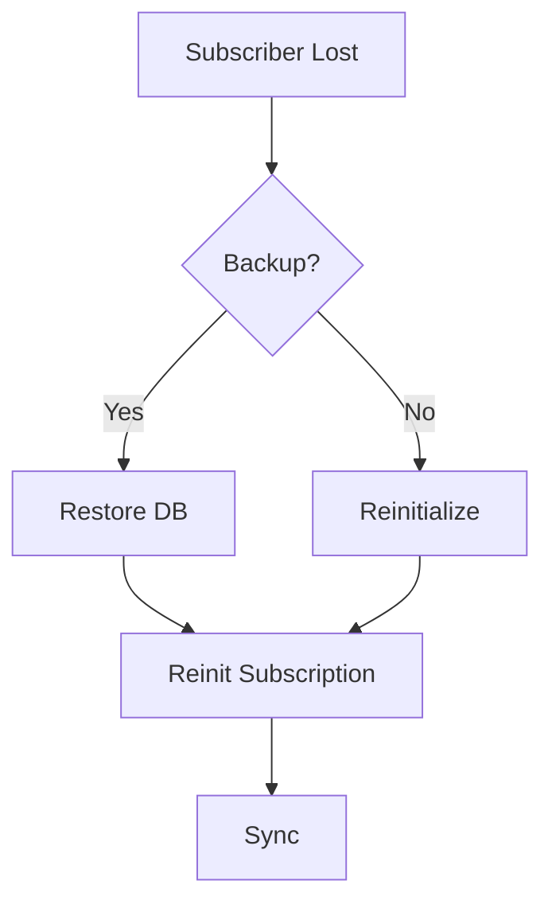

# Disaster Recovery Guide

Backup strategies, recovery procedures, and failover planning for Merge Replication.

---

## 1. Backup Strategy

### Databases to Backup



| Database | Frequency | Notes |
|----------|-----------|-------|
| Publication DB | Daily | Primary data source |
| Distribution DB | Daily | Critical replication state |
| Subscriber DBs | Daily | Preserve local changes |
| msdb | Weekly | Agent job definitions |

### Backup Commands

```sql
-- Full backup
BACKUP DATABASE YourPublicationDB 
TO DISK = 'D:\Backups\PubDB_Full.bak'
WITH INIT, COMPRESSION, CHECKSUM;

BACKUP DATABASE distribution 
TO DISK = 'D:\Backups\Distribution_Full.bak'
WITH INIT, COMPRESSION, CHECKSUM;

-- Transaction log
BACKUP LOG YourPublicationDB 
TO DISK = 'D:\Backups\PubDB_Log.trn'
WITH COMPRESSION;
```

---

## 2. Recovery Scenarios

### Scenario A: Subscriber Failure



**Steps:**

1. **Restore from backup:**
   ```sql
   RESTORE DATABASE SubscriberDB 
   FROM DISK = 'D:\Backups\SubscriberDB.bak'
   WITH RECOVERY;
   ```

2. **Reinitialize:**
   ```sql
   EXEC sp_reinitmergesubscription 
       @publication = 'YourPublication',
       @subscriber = 'SUBSCRIBER_NAME',
       @subscriber_db = 'SubscriberDB',
       @upload_first = 0;
   ```

---

### Scenario B: Publisher Failure

**Steps:**

1. **Restore databases to same point:**
   ```sql
   RESTORE DATABASE YourPublicationDB 
   FROM DISK = 'D:\Backups\PubDB_Full.bak'
   WITH NORECOVERY;
   
   RESTORE LOG YourPublicationDB 
   FROM DISK = 'D:\Backups\PubDB_Log.trn'
   WITH RECOVERY;
   
   RESTORE DATABASE distribution 
   FROM DISK = 'D:\Backups\Distribution_Full.bak'
   WITH RECOVERY;
   ```

2. **If synchronized:** Subscriptions reconnect automatically

3. **If NOT synchronized:** Reinitialize all subscriptions

---

### Scenario C: Distribution DB Corruption

1. Stop all replication agents
2. Drop distribution:
   ```sql
   EXEC sp_dropdistributor @no_checks = 1, @ignore_distributor = 1;
   ```
3. Reconfigure distribution (see [Implementation Guide](../setup/01-implementation-guide.md#phase-2-configure-distributor))
4. Recreate publication
5. Reinitialize all subscriptions

---

## 3. Reinitialization Procedures

### Preserve Subscriber Changes

```sql
EXEC sp_reinitmergesubscription 
    @publication = 'YourPublication',
    @subscriber = 'SUBSCRIBER_NAME',
    @subscriber_db = 'SubscriberDB',
    @upload_first = 1; -- Upload before snapshot
```

### Full Reinitialization

```sql
-- Mark for reinit
EXEC sp_reinitmergepullsubscription 
    @publication = 'YourPublication',
    @publisher = 'PUBLISHER',
    @publisher_db = 'YourDB';

-- Generate snapshot
EXEC sp_startmergesnapshotgenerationjob 
    @publication = 'YourPublication';
```

---

## 4. Failover Procedure

### Manual Failover to Standby


**Steps:**

1. Activate standby database
2. Configure as Publisher
3. Update subscriptions:
   ```sql
   EXEC sp_changemergesubscription 
       @publication = 'YourPublication',
       @subscriber = @@SERVERNAME,
       @subscriber_db = 'SubscriberDB',
       @property = 'publisher',
       @value = 'NEW_PUBLISHER_NAME';
   ```

---

## 5. Recovery Testing (Quarterly)

### Test Checklist

- [ ] Restore Publisher database
- [ ] Restore Distribution database
- [ ] Verify replication reconfigures
- [ ] Test subscriber sync
- [ ] Verify data integrity
- [ ] Document recovery time

### Verification Query

```sql
-- Compare row counts
SELECT 'Publisher' AS Source, COUNT(*) FROM YourTable
UNION ALL
SELECT 'Subscriber', COUNT(*) FROM YourTable;

-- Checksum comparison
SELECT CHECKSUM_AGG(CHECKSUM(*)) FROM YourTable;
```

---

## 6. Prevention

### Monitoring Alerts

```sql
EXEC msdb.dbo.sp_add_alert 
    @name = N'Replication Failure',
    @message_id = 14151,
    @severity = 0,
    @enabled = 1;
```

### Backup Monitoring

```sql
SELECT 
    database_name,
    backup_finish_date,
    DATEDIFF(HOUR, backup_finish_date, GETDATE()) AS HoursSinceBackup
FROM msdb.dbo.backupset
WHERE database_name IN ('YourPublicationDB', 'distribution')
ORDER BY backup_finish_date DESC;
```

---

## 7. Runbook Template

```markdown
## DR Contacts
- Primary DBA: [Name] [Phone]
- Backup DBA: [Name] [Phone]

## Server Inventory
| Role | Server | IP |
|------|--------|----|
| Publisher | | |
| Subscriber 1 | | |

## Backup Locations
- Publisher: \\BackupServer\SQLBackups\Publisher
- Distribution: \\BackupServer\SQLBackups\Distribution

## Recovery Objectives
- Publisher RTO: 4 hours
- Subscriber RTO: 2 hours
```

---

## Related Documents

- [Maintenance Guide](01-maintenance-guide.md) → Regular operations
- [Troubleshooting](02-troubleshooting-guide.md) → Error resolution
- [Security Guide](../setup/02-security-guide.md) → Secure backups
