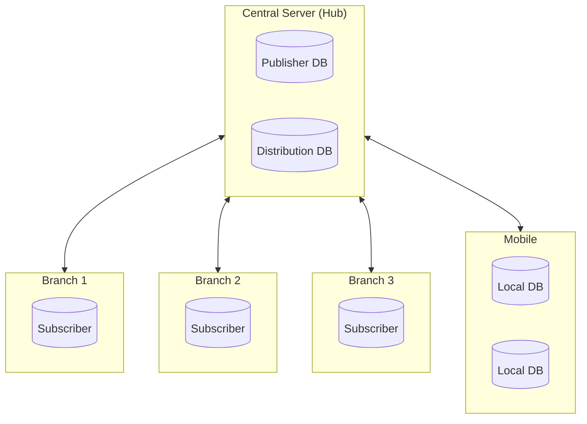
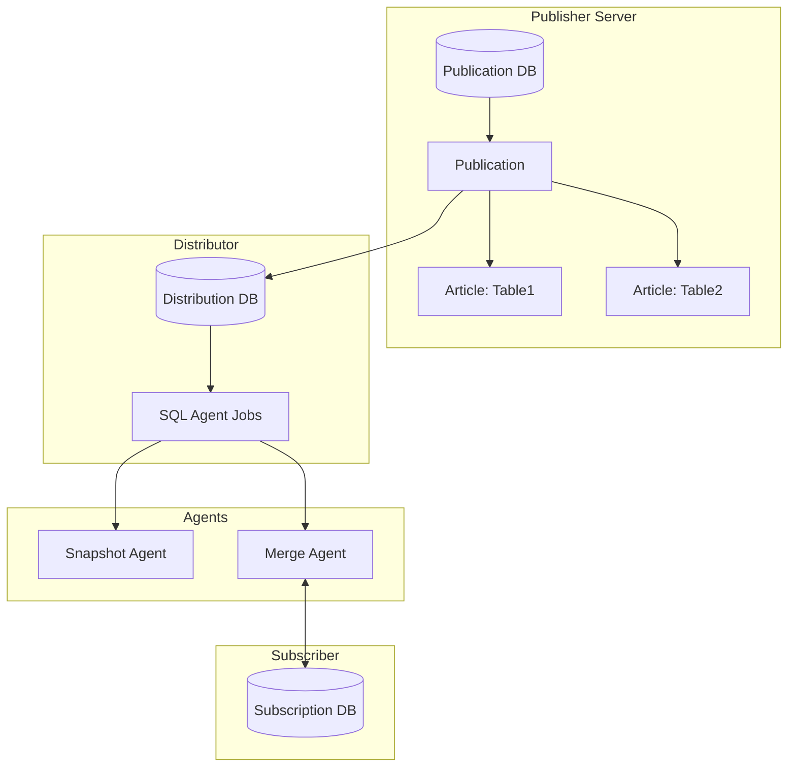
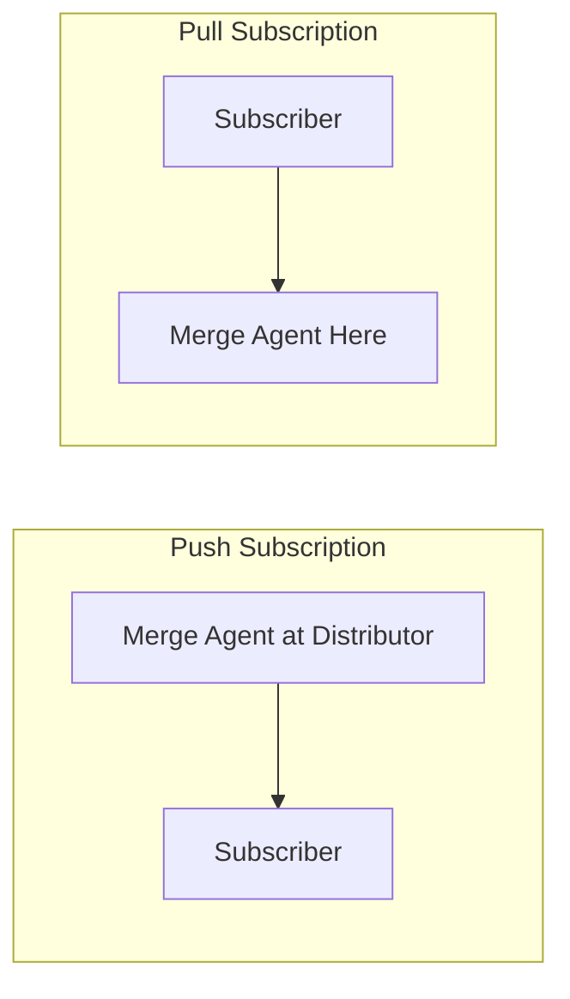
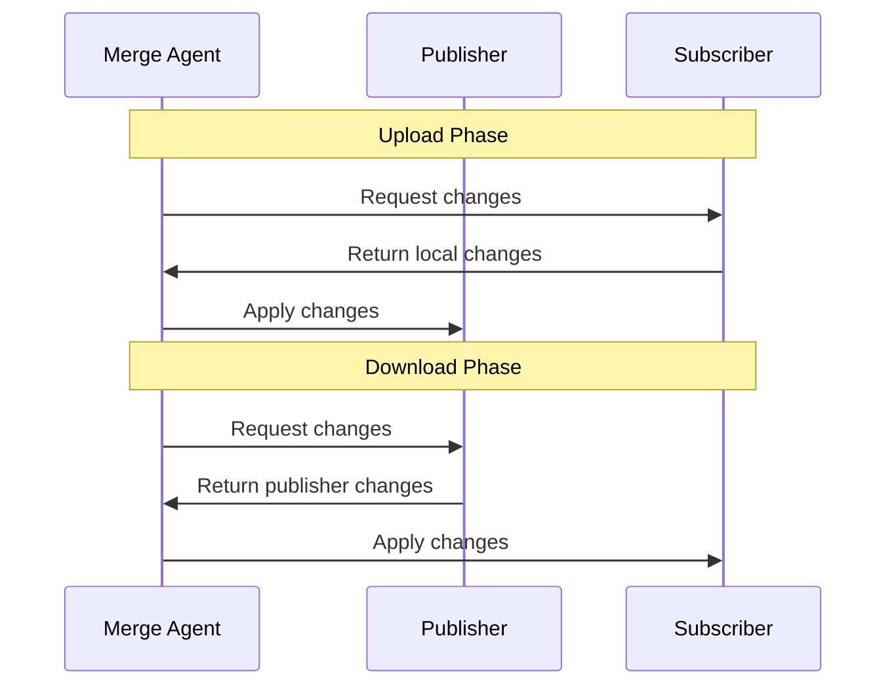
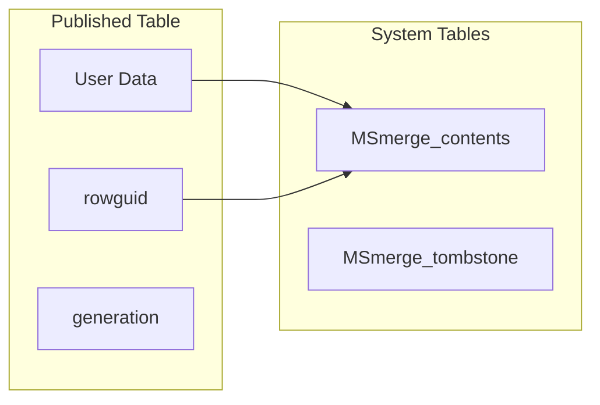
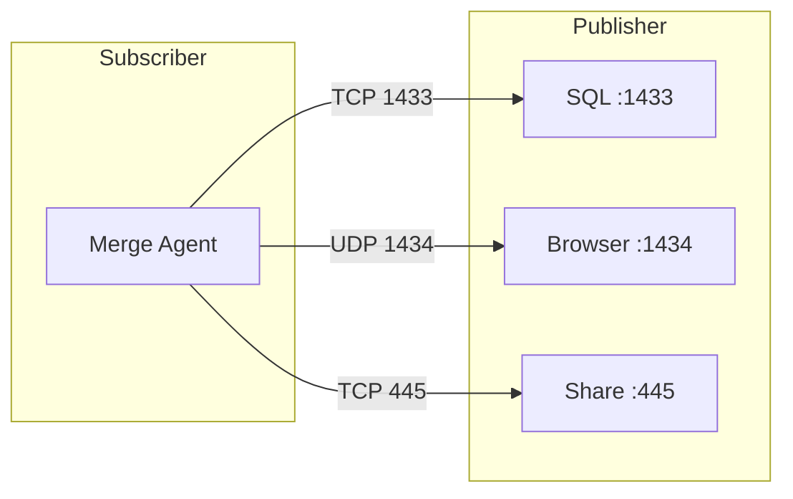
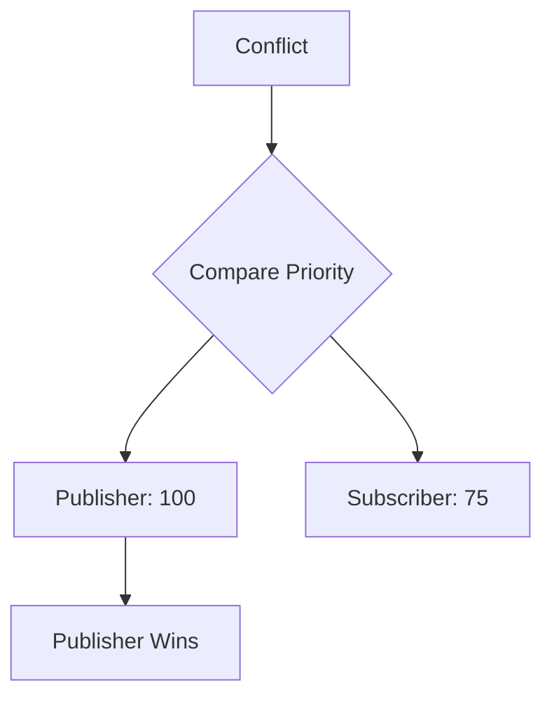
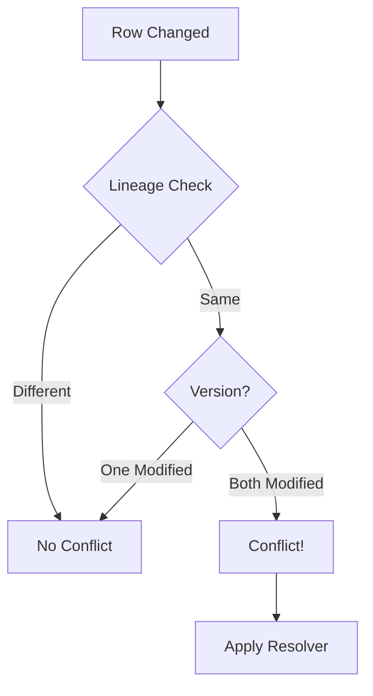
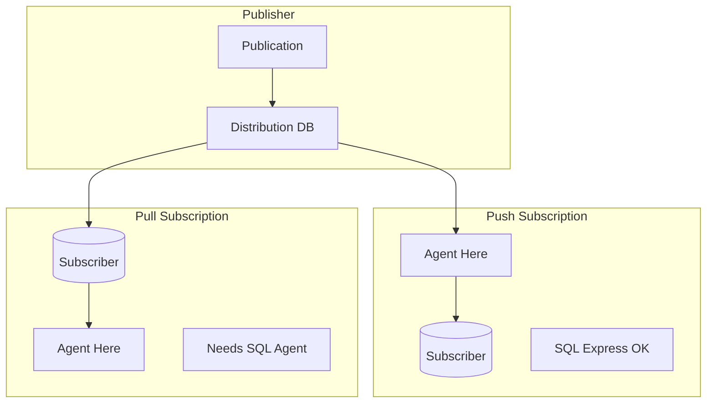
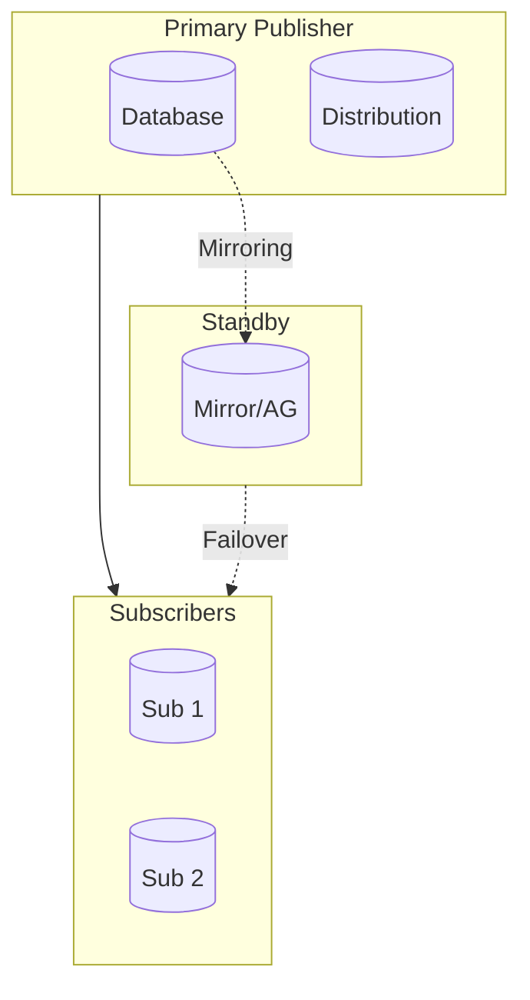

# Architecture Reference

Detailed architectural diagrams for SQL Server Merge Replication.

---

## 1. Topology Options

### Hub-and-Spoke (Recommended)

**Characteristics:**
- All sync routes through central hub
- Clear conflict resolution hierarchy
- Simpler to manage

---

## 2. Component Architecture

### Component Roles

| Component | Role |
|-----------|------|
| **Publication** | Defines replicated data |
| **Article** | Individual table in publication |
| **Distribution DB** | Stores metadata/history |
| **Snapshot Agent** | Creates initial snapshot |
| **Merge Agent** | Syncs changes bidirectionally |

---

## 3. Agent Execution

### Push vs Pull

| Aspect | Push | Pull |
|--------|------|------|
| Agent Location | Distributor | Subscriber |
| For SQL Express | ✅ Yes | ❌ No |
| Management | Centralized | Distributed |

---

## 4. Data Flow

### Synchronization Process

### Change Tracking

---

## 5. Network Ports

---

## 6. Conflict Resolution

### Priority-Based

### Detection Flow

---

## 7. Subscription Types

---

## 8. High Availability

---

## Related Documents

- [Overview](../getting-started/01-overview.md) → High-level architecture
- [Implementation Guide](../setup/01-implementation-guide.md) → Setup steps
- [Glossary](../getting-started/03-glossary.md) → Term definitions
