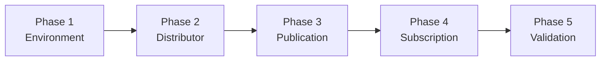
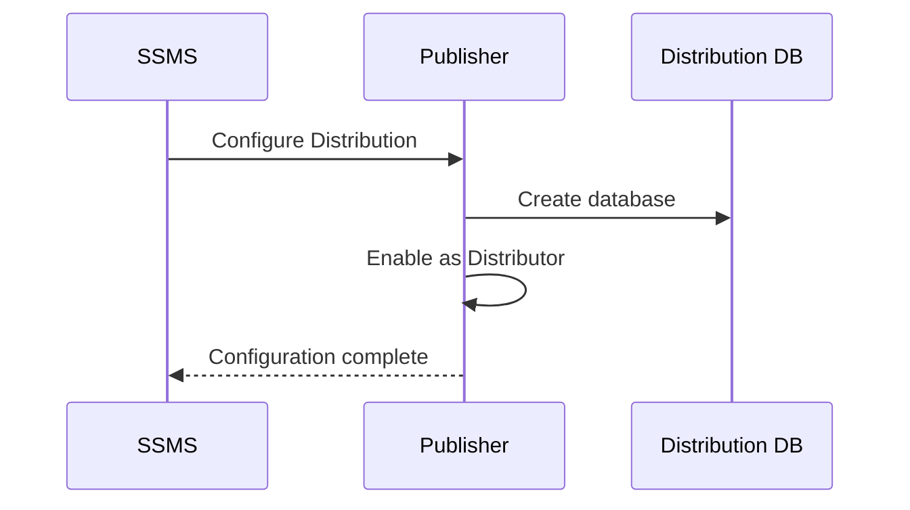
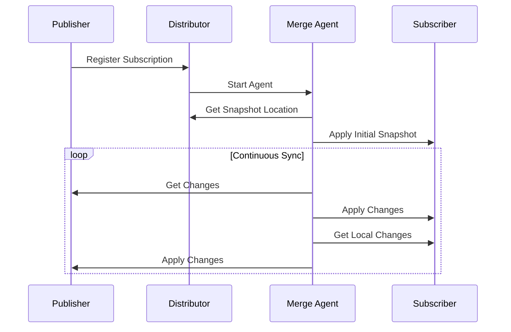

# Implementation Guide

Complete step-by-step setup of SQL Server Merge Replication in a Hub-and-Spoke topology.

> ⚠️ **Prerequisite**: Complete the [Prerequisites Checklist](../getting-started/02-prerequisites.md) before proceeding.

## Overview



---

## Phase 1: Environment Setup

### 1.1 Enable TCP/IP Protocol

**On each SQL Server instance:**

1. Open **SQL Server Configuration Manager**
   - Press `Win+R` → type `SQLServerManager16.msc` (version varies)
2. Expand **SQL Server Network Configuration**
3. Click **Protocols for [InstanceName]**
4. Right-click **TCP/IP** → **Enable**
5. Right-click **TCP/IP** → **Properties**
6. Go to **IP Addresses** tab → scroll to **IPAll**
7. Set **TCP Port** = `1433` (clear TCP Dynamic Ports)
8. Click **OK**

> ⚠️ **Important**: Restart SQL Server service after this change.


### 1.2 Configure Windows Firewall

**Open required ports:**

```powershell
# Run as Administrator
# SQL Server Database Engine
New-NetFirewallRule -DisplayName "SQL Server" -Direction Inbound -Protocol TCP -LocalPort 1433 -Action Allow

# SQL Server Browser
New-NetFirewallRule -DisplayName "SQL Browser" -Direction Inbound -Protocol UDP -LocalPort 1434 -Action Allow

# File Sharing (Snapshot)
New-NetFirewallRule -DisplayName "SMB Snapshot" -Direction Inbound -Protocol TCP -LocalPort 445 -Action Allow
```


### 1.3 Create Snapshot Folder

**On Publisher:**

```powershell
# Create folder
New-Item -Path "C:\ReplData" -ItemType Directory

# Share folder
New-SmbShare -Name "ReplData" -Path "C:\ReplData" -FullAccess "Administrators" -ChangeAccess "Everyone"

# Set NTFS permissions (adjust username as needed)
$acl = Get-Acl "C:\ReplData"
$rule = New-Object System.Security.AccessControl.FileSystemAccessRule("sql_repl_agent","Modify","ContainerInherit,ObjectInherit","None","Allow")
$acl.SetAccessRule($rule)
Set-Acl "C:\ReplData" $acl
```

### 1.4 Verify Connectivity

**From each Subscriber, test:**

```cmd
# Test hostname resolution
ping PUBLISHER_HOSTNAME

# Test SQL port
Test-NetConnection -ComputerName PUBLISHER_HOSTNAME -Port 1433

# Test share access
dir \\PUBLISHER_HOSTNAME\ReplData
```

✅ **Checkpoint**: All tests pass before proceeding.

---

## Phase 2: Configure Distributor

The Distributor stores replication metadata. For simplicity, configure the Publisher as its own Distributor.

### 2.1 Configure Distribution via SSMS

1. Connect to **Publisher** in SSMS
2. Right-click **Replication** folder → **Configure Distribution**
3. Click **Next** on Welcome screen
4. Select **'[ServerName]' will act as its own Distributor**
5. **Snapshot folder**: Enter UNC path `\\PUBLISHER_HOSTNAME\ReplData`
6. **Distribution database**: Accept defaults or customize
   - Name: `distribution`
   - Data file location: (choose appropriate drive)
   - Log file location: (choose appropriate drive)
7. Click **Next** → **Finish**




### 2.2 Verify Distribution

```sql
-- Run on Publisher
USE distribution;
GO
SELECT * FROM MSpublisher_databases;
SELECT * FROM MSdistributor;
```

✅ **Checkpoint**: Distribution database exists and queries return results.

---

## Phase 3: Create Publication

### 3.1 Create Publication via SSMS

1. In SSMS, expand **Replication** → right-click **Local Publications**
2. Click **New Publication**
3. Click **Next** on Welcome screen
4. **Publication Database**: Select your database
5. **Publication Type**: Select **Merge publication**
6. **Subscriber Types**: Select **SQL Server 2008 or later**
7. **Articles**: 
   - Expand **Tables**
   - Check tables to replicate
   - Note: SQL Server adds `rowguid` column if not present


### 3.2 Configure Article Properties

For each article (table):
1. Click **Article Properties** → **Set Properties of Highlighted Table**
2. Review key settings:
   - **Destination object name**: Table name at subscriber
   - **Column tracking**: Yes (recommended for conflict detection)
   - **Partition options**: Non-overlapping, single subscription (if applicable)

### 3.3 Set Snapshot Agent Security

1. On **Agent Security** page, click **Security Settings**
2. **Process account**: Select **Run under the following Windows account**
3. Enter service account credentials (`sql_repl_agent`)
4. **Connect to Publisher**: Select **By impersonating the process account**


> 🔐 For detailed security options, see [Security Guide](02-security-guide.md)

### 3.4 Complete Publication

1. **Snapshot Agent**: Check **Create a snapshot immediately**
2. **Publication Name**: Enter descriptive name (e.g., `SalesData_Merge`)
3. Click **Finish**

### 3.5 Monitor Snapshot Generation

1. Right-click publication → **View Snapshot Agent Status**
2. Wait for status: **"A snapshot of X article(s) was generated"**


✅ **Checkpoint**: Snapshot completes successfully.

---

## Phase 4: Create Subscriptions

For SQL Server Express subscribers, use **Push** subscriptions (agents run on Distributor).

### 4.1 Create Push Subscription

1. Right-click publication → **New Subscriptions**
2. **Publication**: Verify correct publication selected
3. **Distribution Agent Location**: Select **Run all agents at the Distributor (push subscriptions)**
4. **Subscribers**:
   - Click **Add Subscriber** → **Add SQL Server Subscriber**
   - Connect to Subscriber instance
   - Select or create destination database


### 4.2 Configure Merge Agent Security

1. Click on subscription → **...** button
2. **Merge Agent Security**:
   - **Process account**: Service account (`sql_repl_agent`)
   - **Connect to Distributor**: By impersonating process account
   - **Connect to Subscriber**: By impersonating process account (or SQL login)

### 4.3 Set Synchronization Schedule

1. **Agent Schedule**: Choose based on requirements:
   - **Run continuously**: Near real-time sync
   - **Run on demand only**: Manual sync
   - **Define schedule**: Specific intervals

2. **Initialize Subscriptions**:
   - When: **Immediately**
   - Initialize from: **Snapshot**

3. Click **Next** → **Finish**




### 4.4 Repeat for Additional Subscribers

Repeat steps 4.1-4.3 for each Subscriber in the topology.

✅ **Checkpoint**: All subscriptions show "Running" in Replication Monitor.

---

## Phase 5: Validation & Testing

### 5.1 Open Replication Monitor

1. In SSMS, right-click **Replication** → **Launch Replication Monitor**
2. Expand Publisher → select publication
3. View **All Subscriptions** tab


### 5.2 Test Bidirectional Sync

**Test 1: Publisher to Subscribers**
```sql
-- On Publisher
INSERT INTO YourTable (Column1, Column2) VALUES ('FromPublisher', GETDATE());
```
Wait 30-60 seconds, verify on Subscribers:
```sql
-- On each Subscriber
SELECT * FROM YourTable WHERE Column1 = 'FromPublisher';
```

**Test 2: Subscriber to Publisher**
```sql
-- On Subscriber
INSERT INTO YourTable (Column1, Column2) VALUES ('FromSubscriber1', GETDATE());
```
Wait 30-60 seconds, verify on Publisher and other Subscribers.

### 5.3 Test Offline Resiliency

1. **Disconnect** Subscriber from network
2. Insert records on disconnected Subscriber:
   ```sql
   INSERT INTO YourTable (Column1) VALUES ('OfflineRecord1');
   INSERT INTO YourTable (Column1) VALUES ('OfflineRecord2');
   ```
3. **Reconnect** Subscriber to network
4. Force sync or wait for scheduled sync
5. Verify records appear on Publisher

### 5.4 Test Conflict Handling

1. **Disconnect** Subscriber from network
2. **On Publisher**: Update specific row
   ```sql
   UPDATE YourTable SET Column1 = 'PublisherWins' WHERE ID = 100;
   ```
3. **On Subscriber**: Update same row
   ```sql
   UPDATE YourTable SET Column1 = 'SubscriberValue' WHERE ID = 100;
   ```
4. **Reconnect** Subscriber
5. Check conflict resolution:
   - Right-click publication → **View Conflicts**
   - Default: Publisher wins (higher priority)

> 🔧 For conflict management, see [Maintenance Guide](../operations/01-maintenance-guide.md#2-handling-conflicts)

✅ **Final Checkpoint**: All tests pass. Replication is operational.

---

## Post-Setup Checklist

- [ ] All subscriptions show "Running" status
- [ ] Bidirectional sync verified
- [ ] Offline resiliency confirmed
- [ ] Conflict resolution working as expected
- [ ] Performance baseline documented
- [ ] Monitoring alerts configured (optional)

---

## Next Steps

- [Security Guide](02-security-guide.md) → Harden your configuration
- [Maintenance Guide](../operations/01-maintenance-guide.md) → Ongoing operations
- [Troubleshooting](../operations/02-troubleshooting-guide.md) → If issues arise
