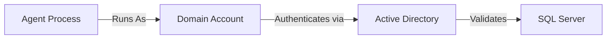
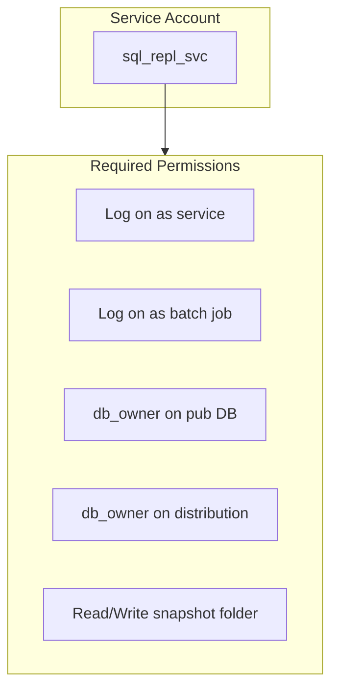
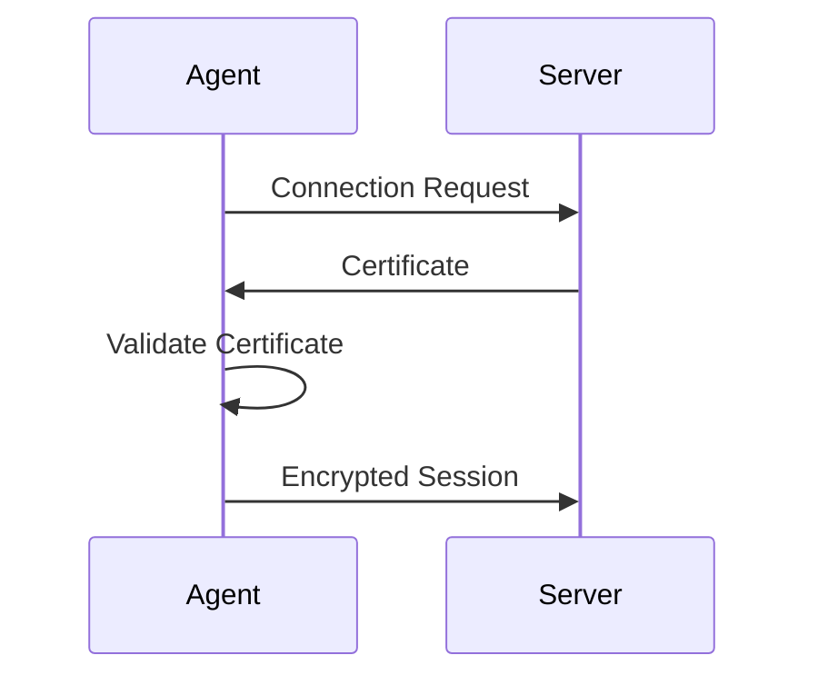
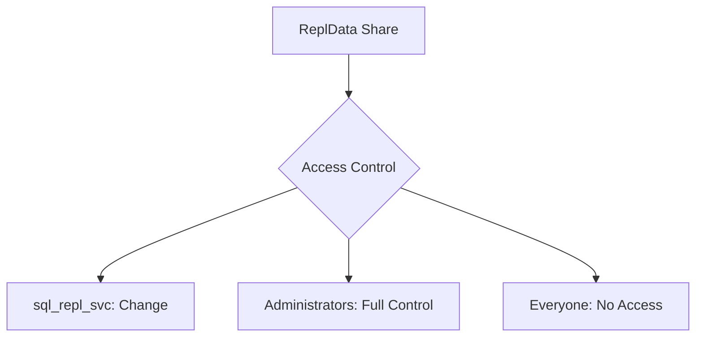

# Security Guide

Security best practices for Merge Replication environments including authentication, encryption, and access control.

---

## 1. Authentication Modes

### Windows Authentication (Recommended)

Preferred for domain environments:



**Advantages:**
- Centralized credential management
- Kerberos delegation support
- Password policies enforced by AD
- No credentials stored in connection strings

### SQL Server Authentication

Required when:
- Workgroup (non-domain) environments
- Cross-domain without trust
- Web synchronization scenarios

```sql
-- Create dedicated SQL login
CREATE LOGIN repl_agent WITH PASSWORD = 'StrongPassword123!';

-- Grant required permissions
USE YourDatabase;
CREATE USER repl_agent FOR LOGIN repl_agent;
ALTER ROLE db_owner ADD MEMBER repl_agent;
```

> ⚠️ **Warning**: SQL passwords are transmitted over network. Always use with TLS encryption.

### Enable Mixed Mode

```sql
-- Check current authentication mode
SELECT SERVERPROPERTY('IsIntegratedSecurityOnly');
-- 0 = Mixed Mode, 1 = Windows Only
```

To enable: SSMS → Server Properties → Security → SQL Server and Windows Authentication → Restart SQL Server

---

## 2. Service Accounts

### Principle of Least Privilege

Create dedicated accounts with minimal permissions:



### Create Service Account

```powershell
# Create service account (non-admin)
$Password = ConvertTo-SecureString "StrongPassword123!" -AsPlainText -Force
New-LocalUser -Name "sql_repl_svc" -Password $Password -PasswordNeverExpires -UserMayNotChangePassword
```

### Windows Rights Assignment

Via Local Security Policy (`secpol.msc`):

1. Navigate to **Local Policies** → **User Rights Assignment**
2. Add `sql_repl_svc` to:
   - **Log on as a service**
   - **Log on as a batch job**


### SQL Server Permissions

```sql
-- Create login from Windows account
CREATE LOGIN [SERVER\sql_repl_svc] FROM WINDOWS;

-- Grant minimal roles
USE YourPublicationDB;
CREATE USER [sql_repl_svc] FOR LOGIN [SERVER\sql_repl_svc];
ALTER ROLE db_owner ADD MEMBER [sql_repl_svc];

USE distribution;
CREATE USER [sql_repl_svc] FOR LOGIN [SERVER\sql_repl_svc];
ALTER ROLE db_owner ADD MEMBER [sql_repl_svc];
```


---

## 3. Encryption

### TLS/SSL for SQL Connections

Force encrypted connections:



**Server Configuration:**

1. Install SSL certificate on SQL Server
2. SQL Server Configuration Manager → SQL Server Network Configuration
3. Right-click Protocols → Properties
4. Set **Force Encryption** = Yes
5. Select certificate from dropdown

**Verify Encryption:**

```sql
SELECT 
    session_id,
    encrypt_option,
    client_net_address
FROM sys.dm_exec_connections
WHERE session_id = @@SPID;
-- encrypt_option should be TRUE
```

---

## 4. Network Security

### Firewall Configuration

Minimal port exposure:

| Port | Direction | Purpose | Restrict To |
|------|-----------|---------|-------------|
| 1433 | Inbound | SQL Engine | Known IPs only |
| 1434 | Inbound | SQL Browser | Known IPs only |
| 445 | Inbound | SMB Snapshot | Agent servers only |

**Restrict by IP:**

```powershell
# Allow only specific remote IPs
New-NetFirewallRule -DisplayName "SQL Server - Restricted" `
    -Direction Inbound -Protocol TCP -LocalPort 1433 `
    -RemoteAddress "192.168.1.10,192.168.1.20" -Action Allow
```

---

## 5. Snapshot Folder Security

### Share Permissions



**Configure Minimal Access:**

```powershell
# Remove default permissions
Revoke-SmbShareAccess -Name "ReplData" -AccountName "Everyone" -Force

# Grant only required access
Grant-SmbShareAccess -Name "ReplData" -AccountName "sql_repl_svc" -AccessRight Change -Force
Grant-SmbShareAccess -Name "ReplData" -AccountName "Administrators" -AccessRight Full -Force
```

### NTFS Permissions

```powershell
$acl = Get-Acl "C:\ReplData"
$acl.SetAccessRuleProtection($true, $false)

$adminRule = New-Object System.Security.AccessControl.FileSystemAccessRule(
    "Administrators", "FullControl", "ContainerInherit,ObjectInherit", "None", "Allow")
$svcRule = New-Object System.Security.AccessControl.FileSystemAccessRule(
    "sql_repl_svc", "Modify", "ContainerInherit,ObjectInherit", "None", "Allow")

$acl.SetAccessRule($adminRule)
$acl.SetAccessRule($svcRule)
Set-Acl "C:\ReplData" $acl
```

---

## 6. Agent Security Configuration

When configuring agents in the wizard:


```
Agent Security → Run under the following Windows account
    ✓ Use Windows account credentials
    Account: DOMAIN\sql_repl_svc
    Password: ************
    
    Connect to Publisher: By impersonating the process account
    Connect to Subscriber: By impersonating the process account
```

---

## 7. Auditing

### SQL Server Audit

Track replication-related activities:

```sql
CREATE SERVER AUDIT ReplicationAudit
TO FILE (FILEPATH = 'C:\AuditLogs\')
WITH (ON_FAILURE = CONTINUE);
GO

CREATE SERVER AUDIT SPECIFICATION ReplicationSpec
FOR SERVER AUDIT ReplicationAudit
ADD (DATABASE_OBJECT_CHANGE_GROUP),
ADD (DATABASE_PERMISSION_CHANGE_GROUP);
GO

ALTER SERVER AUDIT ReplicationAudit WITH (STATE = ON);
```

---

## 8. Security Checklist

### Pre-Deployment
- [ ] Dedicated service account created (non-admin)
- [ ] SQL logins created with minimal permissions
- [ ] Snapshot folder has restricted access
- [ ] Firewall rules limit source IPs
- [ ] TLS encryption enabled

### Periodic Review
- [ ] Review agent account permissions
- [ ] Check for orphaned logins
- [ ] Validate firewall rules
- [ ] Update TLS certificates before expiry

---

## Common Mistakes

| Mistake | Risk | Correction |
|---------|------|------------|
| Using `sa` account | Full server access | Create dedicated limited account |
| Open firewall to all IPs | Exposure to attacks | Restrict to known IPs |
| `Everyone` share access | Unauthorized access | Remove and restrict |
| No encryption | Data interception | Enable TLS |

---

## Related Documents

- [Prerequisites](../getting-started/02-prerequisites.md) → Account setup steps
- [Troubleshooting](../operations/02-troubleshooting-guide.md) → Authentication errors
- [Disaster Recovery](../operations/03-disaster-recovery.md) → Secure backups
